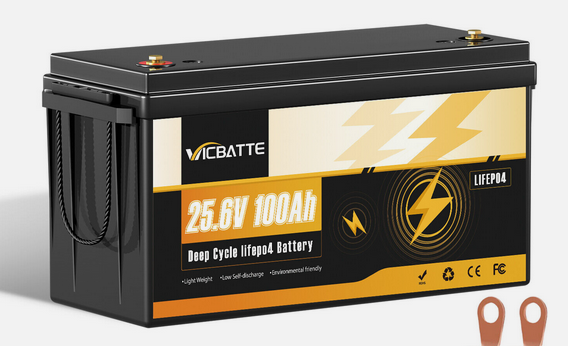

# Battery considerations

## Recommendation: 24 V LiFePo4 Block

### Type

Regarding the Type or Chemistry of the battery: I would recommend getting a LiFePo4 ( Lithium Iron Phosphate) Battery. The main reason is:  

* Safety (no thermal runanway possible)
* Many charge and discharge cycles, so that it doesnt have to be thrown away in a few years, reducing trash
* Its more lightweight than lead batteries (ist a bus - need to not exceed max. road legal overall weight)

Comparison LiFePo4 - Li-Io - Lead:
  
* LiFePo4 is more expensive than lead batteries but higher charge-discharge cycles
* LiFePo4 less expensive but heavier than Li-Io
  
: List of Types of Batteries

| Type    | Pros | Cons | 
| :-------- | :-------: | -------: |
| Lead-Acid | cheap   | low cycle n, heavy, big, need maintenace |
| AGM | cheap   | low cycle n, heavy, big |
| Li-Io | small   | expensive low cycle n, dangerous |
| Li-FePo4 | medium weight | high cycle n |

### Voltage 

Because the electronic devices running on 24 V are the least expensive for power usage of around 200 W usually, and rarely at a maximum of 2 kW. So thats my recommendation for the voltage level.  
Personally i would use 48 V for higher power transfer efficiency, but here, as lights, fridge and laptop is the power consumption, i would propose to use 24 V.  
A 12 V System would mean that very high current is necessary to run at the peak power consumption, which is not good.  

### Type related safety system: integrated BMS

So, to make it easy and least expensive, a 24 V Battery with integrated BMS (Battery Management System) is proposed.  

The BMS will shut down the Battery in case of a fault:  
* Overcurrent
* Overtemperature
* Overdischarge
* Overcharge

The BMS is the last safety barrier, so the external electronic modules are taking care that the limits are not reached.  

Specification for the battery:

* Type/ Chemistry: LiFePo4
* Voltage: 24 V
* Capacity: 100 Ah
* Stored Energy: 2,4 kW

### Buy or DIY

: Buy Batteries

| Name    | Voltage | Capacity | Price | Price per kW|
| :-------- | :-------: | :--------: | :-------: | -------: |
| Pylontech US5000  | 48 V    | 4,8 kWh | 940 € |195,8 €/kWh|
| Langzeit LiFePO4 | 12 V | 1,200 kWh | 169 € |140,8 €/kWh |
| Langzeit AGM | 12 V | 1,200 kWh | 123 € |102,5 €/kWh | 
| Power Queen | 24 V | 2,4 kWh | 428 € | 178 €/ kWh|

: Buy/ build from kit w/ cells

| Name    | Spannung | Kapazität | Preis | Preis pro kW|
| :-------- | :-------: | :--------: | :-------: | -------: |
| Basen Green Sheila  | 48 V    | 14,6 kWh | 3500 € |240 €/kWh|S

Example diy kit:  
[Basen Green Sheila EU US Stock Lifepo4 Batterie kästen und Racks 51,2 V 48V 14 kWh 15kWh Gehäuse Leere DIY Metall batterie Zubehör](https://www.alibaba.com/product-detail/basen-greenline-battery-EU-stock-51_1601147027430.html?spm=a2747.product_manager.0.0.186e71d2fLaq6V)

### Buy recommendation

Get any 24 V 100 A Battery w/ BMS for the least amount of money:

[2,4 kWh Battery: 24 V 100 Ah for 290 € on ebay](https://www.ebay.de/itm/186835534523?chn=ps&_ul=DE&norover=1&mkevt=1&mkrid=707-166974-037691-2&mkcid=2&mkscid=101&itemid=186835534523&targetid=2304343365564&device=c&mktype=pla&googleloc=9042565&poi=&campaignid=22015718122&mkgroupid=171943768477&rlsatarget=pla-2304343365564&abcId=10132300&merchantid=5511696169&geoid=9042565&gad_source=1&gclid=CjwKCAiAt4C-BhBcEiwA8Kp0CSqFjO1vNmWwdxwRT4lMIWqcm1ZeTn9IZsmLYMhWQ5fsrWqEPpypuRoCMh8QAvD_BwE)

{ width=40% }

