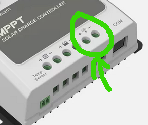

# Electronics, severeal discrete modules

## Solar input 

For charging the battery from the solar panels.   

* MPPT (maximum power tracker)
To regulate the solar input to the battery.
This is DC, depending on the choice of module probable 20 Vdc to 100 Vdc.

| Device Name    | Input Voltage | Output Voltage | Notes |
| :-------- | :-------: | :-------: | -------: |
| Solar Panels to Battery - MPPT DC-DC Converter  | 40 V    | 30 V | - |

### Recommendation: EPEVER VS6048AU

I have good experiences with that one, its quite reliable and survived several festivals since i bought it.    

[EPEVER®PWM Solar Laderegler manual](https://www.epever.com/wp-content/uploads/2021/05/VS-AU-SMS-EL-V1.2.pdf)

{ width=40% }

Technical specifications  

- Model of manufacturer 	VS6048AU
- Related Charge current 	60A
- Max. PV open circuit voltage 	96V
- USB output 	5VDC/2.4A
- Nominal voltage 	12/24/36/48V DC Auto
- Grounding 	Positiv
- Temperature 	-20°C bis +55°C
- Dimension 	214 * 128,7 * 72,2mm
- Weight 	1040g
- Enclosure 	IP30

## Car generator input

The battery should be charged while driving:  

* DC Charging Car engine generator DC converter
For charging the system battery with the car engine/ generator.
The input is arounf 14 Vdc.  
We have to take care that below 14 Vdc, the car engine/ generator is off, and we would use energy from the car battery, which we do not want to do.
So the DC-DC Converter needs to bea switched on only when the input Voltage is above 14 Vdc.

| Device Name    | Input Voltage | Output Voltage | Notes |
| :-------- | :-------: | :-------: | -------: |
| Car to MPPT DC-DC Converter  | 12 V    | 30 V | off below 14 V input Voltage|

There is a high power DC-DC converter:  

- Product name: High-power non-isolated DC boost module power supply.
- Product model: 100A2000W.
- Input voltage: DC12V-60V.
- Input current: 100A (maximum).
- Input power: 2000W (maximum).
- No-load power consumption: less than 2W.
- Output voltage: DC15V-80V.
- Output current: 50A (maximum).
- Output power: 1850W (maximum).
- Conversion efficiency: 92-96% (efficiency is related to input and output voltage and current).
- Working temperature: -20~50℃.
- Price: around 100 €

[DC-DC Converterm, 100 A input, 2 kW, 100 on ebay](https://www.ebay.de/itm/156099383075?mkevt=1&mkcid=1&mkrid=707-53477-19255-0&campid=5339016285&toolid=10049&customid=CjwKCAiAt4C-BhBcEiwA8Kp0CbZNfENoR6pcyw1MFqyBXi-En7iQYfJ1k7xw9a6XGKTV6TLAAJpaARoCSMMQAvD_BwE&gad_source=1&gclid=CjwKCAiAt4C-BhBcEiwA8Kp0CbZNfENoR6pcyw1MFqyBXi-En7iQYfJ1k7xw9a6XGKTV6TLAAJpaARoCSMMQAvD_BwE)

{ width=40% }

## Utility (fridge) and lights output

To regulate the charging and discharging, some electronic functions, in discrete/ seperate modules or integrated in one module, have to be implemented:  

* Load output - battery discharge protection
The lights and the fridge should run on DC power from the battery.
To run them on 230 V means one conversion step that can be ommited.
More conversion steps is less efficient than running the fridge an the lights on the battery directly.

The MPTT Tracker has such an Output, this will be used.  

[MPTT Tracker with Load output](https://solarcamp24.de/EPEVER-MPPT-Laderegler-Tracer-4210AN)

{ width=40% }

See Specs VS6048AU - 60 A Output.  

## eBike charger, using another MPPT

For efficient charging of the ebike, i would recommend to use a DC-DC charger instead of connecting it via the 230 Vac outlet.  
Basically the same system consideration as with the lights and the fridge - less conversion steps means higher efficiency.  
Instead of DC to AC to DC, we can use a DC-DC converter.  

To save some money, we can go for another MPPT here, which meets our requiements of being a battery charger foir the eBike.  

The ebike has a charging voltage of 36 Vdc (i think?). It should be charged from the battery which has 24 Vdc.  

So the suggestion is, to use a MPPT tracker for this situation, because it is pretty cheap, and i have good experiance with it:  

[MPT-7210A Manual](https://gotronik.pl/images/MPT-7210A.pdf)

{ width=40% }

Specs:

- Input voltage: DC12-60V
- Output voltage: DC24V-72V adjustable
- Output Current: 0-10A key adjustable
- Output Power: 600W max

## 230 Vac Inverter

For all devices that use a regular houshould plug, there should be a socket availible.  

I do recommend a pure sine wave inverter to not destroy sensible loads. For Motors, sine wave is required anyway.  

For example:  

[12V/24V/48V to 230v 800W/1500W/2000W/2500W/3000W wechselrichter reiner sinus](https://www.ebay.de/itm/384961266752?var=652828902682&mkevt=1&mkcid=1&mkrid=707-53477-19255-0&toolid=20006&campid=5337770552&customid=bGw8Ot0NOd6TzgeKRlah9Q)

{ width=40% }
