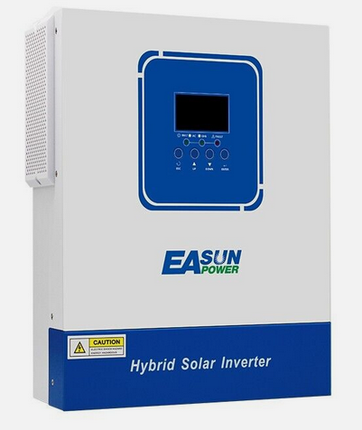

# Electronics, integrated MPTT and Inverter module

To save money and space, we can use onbe module which integrates the main electric components.  

Main Specs would be: 

- Battery voltage: 24 V
- Solar input: Anything above 24 V
- DC Load output
- 230 V Inverter

[Recommendation: Easun 3200W Solar Off Grid Wechselrichter 24V 80A MPPT Ladegerät 230V mit WiFi](https://www.ebay.de/itm/286196447295?mkevt=1&mkcid=1&mkrid=707-53477-19255-0&campid=5338588705&toolid=20006&customid=CjwKCAiAt4C-BhBcEiwA8Kp0CY7qSkYTnKs8hwnxPVoziz6fxXOu01BF826M9p6ABOH81555SHJovxoCZ44QAvD_BwE|null|null&gclid=CjwKCAiAt4C-BhBcEiwA8Kp0CY7qSkYTnKs8hwnxPVoziz6fxXOu01BF826M9p6ABOH81555SHJovxoCZ44QAvD_BwE)  

Price on Ebay is 190 €.  

### Device  
Model: ISolar-SMG-II-3.2KW  
Rated Power: 3.5KW  

### Input  
Voltage: 230Vac  
Selectable Voltage Range: 170Vac~280Vac) ±2% ; (90Vac~280Vac)±2%  
Frequency Range: 50Hz/ 60Hz (Auto detection)  

### Output  
AC Voltage Regulation (Batt.Mode): 230VAC ±5%  
Wave Form: Pure Sine Wave  

### Battery & Solar Charger  
Nominal Battery Voltage: 24VDC  
Floating Charge Voltage: 27VDC  
Overcharge Protection: 33VDC  
Maximum Charge Current: 60A  

### Solar Charger  
MAX.PV Array Power: 4000W  
MPPT Range @ Operating Voltage: 55-450VDC  
Maximum PV Array Open Circuit Voltage: 450VDC  
Maximum Charging Current: 100A  
Maximum Efficiency: 98%  

### Physical
Dimension (D*W*H mm): 330x278x98mm  
Net Weight (kgs):  4.5kg  
Communication Interface: RS232/RS485(Standard) / GPRS/WIFI(Optional)  

### Environment
Humidity: 5% to 95% Relative Humidity (Non-condensing)  
Operating Temperature: 10°C to 55°C  
Storage Temperature: -15°C to 60°C  

{ width=50% }

[Beispiel 2: POW-HVM2H-12V-N, pow-hvm3.2h-24v-n](https://de.aliexpress.com/item/1005008217036025.html?src=google&pdp_npi=4%40dis!EUR!323.26!161.63!!!!!%40!12000044269007207!ppc!!!&src=google&albch=shopping&acnt=272-267-0231&isdl=y&slnk=&plac=&mtctp=&albbt=Google_7_shopping&aff_platform=google&aff_short_key=UneMJZVf&gclsrc=aw.ds&&albagn=888888&&ds_e_adid=&ds_e_matchtype=&ds_e_device=c&ds_e_network=x&ds_e_product_group_id=&ds_e_product_id=de1005008217036025&ds_e_product_merchant_id=5473333314&ds_e_product_country=DE&ds_e_product_language=de&ds_e_product_channel=online&ds_e_product_store_id=&ds_url_v=2&albcp=20542208798&albag=&isSmbAutoCall=false&needSmbHouyi=false&gad_source=1&gclid=CjwKCAiA5eC9BhAuEiwA3CKwQoh_xlgp-pmhDJQ5B36AQuPqHvyr91KkhfEKhgGABP36STVEV90RlxoCzhEQAvD_BwE)

[Beispiel 3: VEVOR 2-in-1-Hybrid-Solar-Wechselrichter 3500W Solar Inverter Reiner Sinus MPPT](https://www.vevor.de/off-grid-solar-wechselrichter-c_10764/vevor-2-in-1-hybrid-solar-wechselrichter-3500w-solar-inverter-7000va-reiner-sinus-mppt-lcd-display-3-lademodi-solarladung-netzladung-hybridladung-4-ausgangsmodi-utl-sol-sbu-sub--p_010705754540?adp=gmc&country=DE&utm_source=google&utm_medium=cpc&utm_id=20903645914&ad_group=158902580044&ad_id=686015976429&utm_term=&gad_source=1&gclid=CjwKCAiA5eC9BhAuEiwA3CKwQo3zZn7coxf38T4Z8qW2QICB_8DxdERUOrMVNBtydjUdAFzRG-e_xBoC_-gQAvD_BwE)

[Beispiel 4:  BlueWalker Inverter 3000 PWM, Wechselrichter](https://www.alternate.de/html/product/1858348?partner=goadwoPLA&campaignCode=STREICHP_OFFPAGE&adffus=8040a8d1&apla=&h_ext=0:0:21476453504:162755922177:pla-297276004016:&gad_source=1&gclid=CjwKCAiAt4C-BhBcEiwA8Kp0Cax__Lf3H16jmXBdhRIrSZY9g_tvs2sGKDZWMvJV_Iwwp_fQhiWC2xoCNd4QAvD_BwE)  
