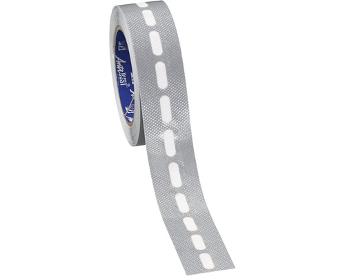
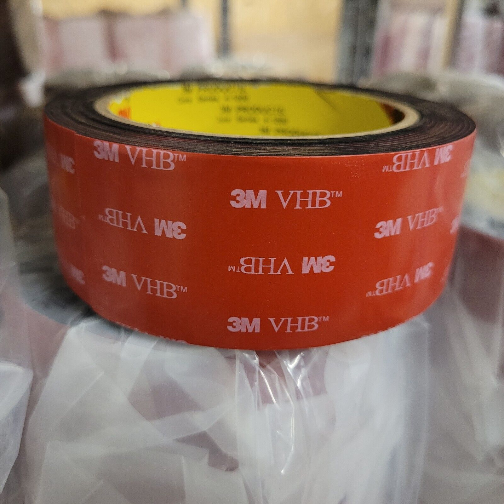
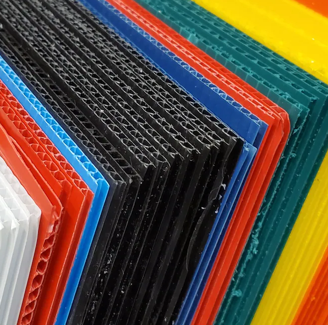
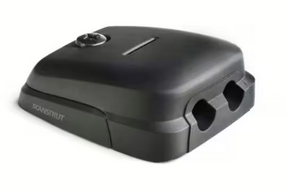

# Roof Mounting Proposal

Goal is to keep the Van watertight and using inexpensive materials with no high effort.
That said, it is possible to create watertight long-life bolt-through connections, but that can be quite hard, and can be avoided.  

: Solving the mounting challange

| Problem    | Fix/ Workaround |
| :-------- | -------: |
| Uneven Surface
| Heat | Gap between Roof and Module|

## Usage of sticky tape and plastic sheet base 

As shown in [Tutorial RV-Mounting Panels](https://www.youtube.com/watch?v=xDqlsEw9Jpg) 

### 1) Avoiding the need to drill holes for the panels -> use sticky tape

The tape should be around the modules to keep them fixed - the tape to be used is for roof application.

* EternaBond RSB-6x50 Dachdichtungsband für Dach Wohnmobil wasserdicht  
  [Abdichtband für Kunsttoffdach](https://www.hornbach.de/p/gutta-abschlussband-fuer-guttaprofile-15-m-x-37-mm/5803008/) 10cm breit

* 3M VHB Tape [Montage Klebeband](https://www.2b-klebebaender.de/3M-5952-1-1mm-dick-schwarz-MONTAGEBAND-DOPPELSEITIGES-KLEBEBAND-BEIDSEITIGES-EXTRA-STARK/3M5952-04-1.5-3)

The cables should be taped down with single-sided tape, the panels and the plastic sheets with double-sided tape.  

{ width=30% } { width=30% } 
\begin{figure}[!h]
\caption{single-sided roof sealing tape and double-sided tape}
\end{figure}

### 2) Uneven surface and heat & water buildup -> use plasic base

To place the Solar modules on a spacer prevents heat and water buildup under the panel. This is to keep an air gap for cooling and to create a even surface.  

* Corrugated Plastic Sheets  
  [Kunstoffplatte](https://www.hornbach.de/p/precit-polycarbonat-hohlkammerplatte-stegplatte-klar-1500-mm-x-700-mm-x-4-5-mm/7413747/?marketNo=541)  
  [colorful plastic sheets:](https://www.etsy.com/de/listing/1050375357/10-pack-corrugated-plastic-sheets-sign)

{ width=40% } 

## Cable duct through the roof

One hole is required to guide the cables into the van. A professional cable through is proposed:

As shown in [Tutorial installing a roof-cable-duct](https://www.youtube.com/watch?v=3e9tL9bnuJs) 

* Scanstrut DS-HD6 Dachdurchführung [Kabeldurchführung](https://lepper-marine.de/Scanstrut-DS-HD6-BLK-Kabeldurchfuehrung/1053-00084)

{ width=55% } 
