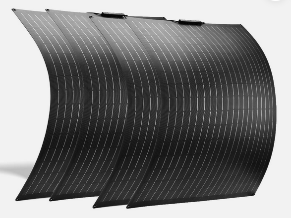

# Solar panels

## The idea is to use tape to mount felxible panels on the roof 

KISS - the most simple way.  

The amount of panels should be low, big panels > small panels. 

Though, bigger panels are more expensive, so most likely we go with ~ 100 W Panels.  

: Deciding which kind of solar panel

| CIGS    |  Flex | Glass |
| :-------- | :-------: |-------: |
| bigger  | smaller    | smaller but thicker|
| less efficient | efficient | efficient |
| hotter | cooler     | cooler|
| lightweight | heavier | very heavy |
| easy to mount | easy to mount | difficult to mount|

## Specification of the Solar panels 

The Specs should be:  

* High efficiency (because of limited space)
* operating voltage above battery voltage
* Power => Surface area

Electically, we assume that the System batter is around 24 Vdc, means 20 V to 30 V.  
Flex Panels are recommended for their robustness and efficiency, even though they are more expensive than the other options. 

| Solar module | mean Voltage | min Voltage | max Voltage | Power |
| :-------- | ------- | ------- | ------- | ------- |
| Flex | 30 V | 24 V | 100 V | min. 400 W |

## Example Proposition

Price should be ideally around 50 € / 100 W.  
For the price to be that low, we cant use big panels, but several smaller ones.

[520W Flexibel Solarmodul 4*130W Solarpanel Mono Camper Wohnmobil Balkonkraftwerk](https://www.ebay.de/itm/135372383086?chn=ps&_ul=DE&norover=1&mkevt=1&mkrid=707-166974-037691-2&mkcid=2&mkscid=101&itemid=135372383086&targetid=2274951440814&device=c&mktype=pla&googleloc=9042565&poi=&campaignid=22225912551&mkgroupid=174545406949&rlsatarget=pla-2274951440814&abcId=10192663&merchantid=5546275235&geoid=9042565&gad_source=1&gclid=CjwKCAiAt4C-BhBcEiwA8Kp0CdVf9NJMtewbyQnIkPlScvLWVl-kWm3VGoAaMtZKypUItchPMRepZxoCI3EQAvD_BwE)

{ width=55% }
